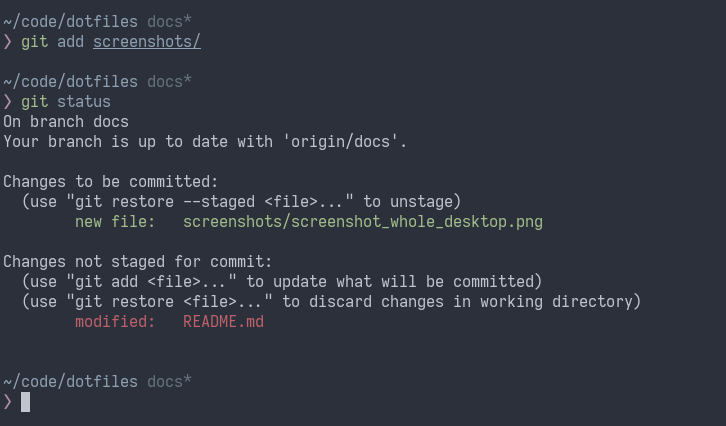
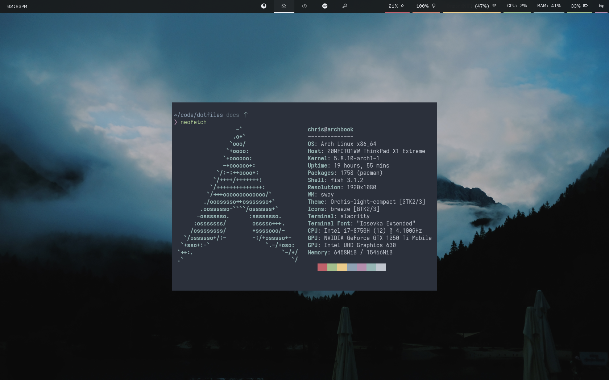

# Dotfiles

The dotfiles themselves can be found in the [master branch](https://github.com/neon64/dotfiles/tree/master).

These dotfiles should theoretically work on any UNIX-like system, including macOS and msys2, both of which I use from time to time. However the greatest compatibility will be with [Arch Linux](https://www.archlinux.org/), which is what I use daily.

## Installation

To install these dotfiles onto a new machine:

    $ alias dotf='/usr/bin/git --git-dir=$HOME/path/to/dotfiles/ --work-tree=$HOME'
    $ echo "path/to/dotfiles/" >> .gitignore
    $ git clone --bare --branch master https://github.com/neon64/dotfiles $HOME/path/to/dotfiles

Then attempt to checkout the configuration files into your home directory:

    $ dotf checkout

You will most likely have to decide what to do with the existing dotfiles on your system.

If `fish` isn't already installed, you'll need to install it now using an
appropriate package manager and also eventually set it as the default shell.

Also update the git repo location used by the script `~/.config/bin/dotf` to point
to wherever you stored the bare dotfiles repository (default is
`~/.local/share/dotfiles`)

Also run the following to ensure untracked files (i.e.: the rest of your home directory) don't show up when running `dotf` commands.

    $ dotf config --local status.showUntrackedFiles no

### Semi-automatic installation

If you're on Arch Linux, you can run the following install script to install a whole heap of packages which power my dotfiles (things like `sway`, `firefox` and loads of little things like `ttf-font-waesome` etc...), as well as plugins for `nvim`, `fish` and `emacs`:

    $ ~/.config/bin/install_dotf

If you're not on Arch Linux, I'm afraid I don't have an all-in-one solution yet. However, try taking a look inside of `~/.config/bin/install/common` for some bits you will be able to run.

See the [installation guide](https://github.com/neon64/dotfiles/tree/master/.config/bin/install) for more information and caveats.

### How to edit these dotfiles?

The brilliant benefit of just using plain `git` to manage dotfiles (as detailed [here](https://developer.atlassian.com/blog/2016/02/best-way-to-store-dotfiles-git-bare-repo/)), is that making changes is easy.

To stage changes to a file, just run:

    $ dotf add path/to/file

If you want to be fancier and stage everything you've changed:

    $ dotf add -u

Don't ever try `dotf add -A` - It tries to stage everything in your home directory :D

To commit changes:

    $ dotf commit -m "Describing the change"

In conclusion: it's exactly like normal Git, just with `git` replaced with the script `dotf` (which is just a wrapper for git internally)

## About these dotfiles

### Included software

**Window Manager**
 - [sway](https://github.com/swaywm/sway/), as my daily driver when I'm on Linux
    - [waybar](https://github.com/Alexays/Waybar) as the bar, with icons from `ttf-line-awesome`.
    - [wofi](https://hg.sr.ht/~scoopta/wofi) (similar to rofi)
    - [fzf](https://github.com/junegunn/fzf) drives a lot of my config
    - **[my notes](https://github.com/neon64/dotfiles/tree/master/.config/sway)**

**Terminal Emulator & Shell**
 - [alacritty](https://github.com/jwilm/alacritty/), a fast terminal emulator written in Rust.
 - [fish shell](https://fishshell.com/)
   - **[my notes](https://github.com/neon64/dotfiles/tree/master/.config/fish)**
   - [fisherman](https://github.com/fisherman/fisherman) to manage plugins
 - [topgrade](https://github.com/r-darwish/topgrade) to keep everything up-to-date

 - [iTerm 2](https://github.com/gnachman/iTerm2) (on a Mac)
    - **[my notes](https://github.com/neon64/dotfiles/tree/master/.config/iterm2)**

**Editor**
 - Visual Studio Code
 - CLion / Intellij IDEA IDEs
 - [Neovim](https://github.com/neovim/neovim), when I need to use the command line
     - [vim-plug](https://github.com/junegunn/vim-plug) to manage plugins
 - [Doom Emacs](https://github.com/hlissner/doom-emacs)

**Music**
 - Spotify

### Useful scripts

I've found that over time it is easier to write my own shell scripts to do things like enable/disable bluetooth or change wallpapers, as I can tailor those scripts to my particular needs rather than trying to make use of a one-size-fits-all GUI application. That said, this definitely isn't for the faint of heart because these scripts are likely brittle and I am constantly updating them.

 - [browse_files](https://github.com/neon64/dotfiles/blob/master/.config/bin/browse_files): open a graphical file browser, aliased to `b`
 - [browse_web](https://github.com/neon64/dotfiles/blob/master/.config/bin/browse_web): open a URL or search Google
 - [dotf](https://github.com/neon64/dotfiles/blob/master/.config/bin/dotf): manage these dotfiles with git
 - `check_dotf` (fish function): check dotfiles are up to date
 - [fdm](https://github.com/neon64/dotfiles/blob/master/.config/bin/fdm) - FZF display manager - launch different desktop environments from the command-line (sway, gnome, plasma, i3, etc...)
 - [kbd](https://github.com/neon64/dotfiles/blob/master/.config/bin/kbd): activate us-intl keyboard in sway
 - [launch_util](https://github.com/neon64/dotfiles/blob/master/.config/bin/launch_util): command-line app launcher with fzf - currently not used
 - [package_sizes](https://github.com/neon64/dotfiles/blob/master/.config/bin/package_sizes): list packages sorted by size
 - [package_orphans](https://github.com/neon64/dotfiles/blob/master/.config/bin/package_orphans): list orphaned packages
 - [switch_res](https://github.com/neon64/dotfiles/blob/master/.config/bin/switch_res): switches resolutions on Sway, aliased to `sr`
 - [theme](https://github.com/neon64/dotfiles/blob/master/.config/bin/theme): changes themes
 - [wpaper](https://github.com/neon64/dotfiles/blob/master/.config/bin/wpaper): change wallpapers for sway and generates a new lockscreen image

### Machine-specific configuration

These dotfiles are complemented by my machine-specific configuration, [arch_machine](https://github.com/neon64/arch_machine), which takes the form of a collection of packages for [Arch Linux](https://www.archlinux.org/). These packages configure the whole system, rather than being specific to one user-account.
